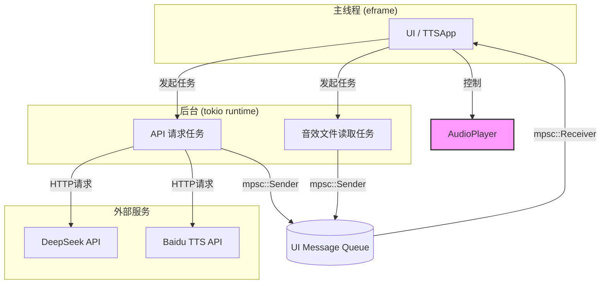

TTSmate V1 系统设计文档

1. 概述

1.1 文档目的
本文档旨在详细描述 TTSmate V1 的系统架构、核心模块设计及关键技术实现。其目标是为后续的开发、维护和功能迭代提供一份清晰、准确的技术参考。

1.2 系统简介
TTSmate V1 是一个基于 Rust 语言开发的轻量级桌面应用程序。它集成了 AI 文本生成（通过 DeepSeek API）和云端文本转语音（通过百度 TTS API）功能，并提供一个简单的音效板。该应用旨在为用户提供一个从“想法”到“语音”的快速转换工具。

1.3 设计原则
- 简洁性: 采用直接、易于理解的架构，避免不必要的复杂性。
- 响应性: UI 操作应保持流畅，耗时操作（如 API 请求、文件 IO）通过异步任务在后台处理。
- 可配置性: 核心功能（API 密钥、AI 行为、音效）均通过一个简单的 TOML 文件进行配置，方便用户自定义。

---

2. 系统架构

2.1 总体架构
TTSmate V1 采用基于 `eframe` (egui) 的单体应用架构。整个应用运行在单个进程中，其核心组件包括：

- UI 主循环: 由 `eframe` 驱动，负责渲染每一帧的界面和处理用户输入。
- 异步运行时: 使用 `tokio` 在后台执行所有耗时操作，如网络请求和文件读取，防止 UI 线程阻塞。
- 状态管理: 通过 `mpsc` 通道实现主 UI 线程与后台 `tokio` 任务之间的安全通信和状态同步。

2.2 模块关系图

2.3 核心技术栈
- GUI 框架: `eframe` / `egui`
- 异步运行时: `tokio`
- 音频播放: `rodio`
- HTTP 客户端: `reqwest`
- 配置文件: `toml`
- 序列化/反序列化: `serde`

---

3. 详细模块设计

3.1 主模块 (`main.rs`)
这是应用程序的核心，包含了大部分逻辑。

- `TTSApp` 结构体: 应用的主结构体，持有所有状态，包括 UI 输入文本、API 客户端、`tokio` 运行时、音频播放器实例以及配置信息。
- `AppState` 枚举: 定义了应用的几种核心状态（如 `Idle`, `GeneratingText`, `SynthesizingAudio`），用于向用户提供清晰的反馈。
- `UIMessage` 枚举: 定义了后台任务与 UI 线程之间的通信消息类型，例如更新状态、播放 TTS 音频、播放音效。
- UI 渲染: `eframe::App` 的 `update` 方法是渲染主入口。为保持代码整洁，UI 被拆分为多个独立的绘制函数：
    - `draw_ai_settings_ui`: 渲染 AI 相关的设置，如 Prompt 模板选择。
    - `draw_tts_parameters_ui`: 渲染语音参数（发音人、语速等）的控件。
    - `draw_soundboard_ui`: 渲染音效板按钮。
- 任务调度: 当用户触发一个动作（如点击“生成并播放”），`TTSApp` 会使用 `tokio` 运行时 (`rt.spawn`) 创建一个异步任务来处理该请求。

3.2 音频播放器 (`AudioPlayer` in `main.rs`)
音频子系统的设计经过简化，直接在 `main.rs` 中实现，优先考虑稳定性和简洁性。

- `AudioPlayer` 结构体:
    - 持有两个 `Arc<Mutex<Option<rodio::Sink>>>` 成员：`tts_sink` 和 `sound_sink`。
    - 使用两个独立的 "Sink"（可以看作是音频播放通道）来分别处理 TTS 语音和音效。
- 播放机制:
    - `play_tts` 和 `play_sound` 方法接收音频数据 (`Vec<u8>`)。
    - 它们会各自在一个新的后台线程中初始化一个 `rodio::OutputStream` 和一个 `Sink`。
    - 音频数据被添加到 `Sink` 中，然后 `Sink` 被 `detach()`。这使得音频可以在后台独立播放，直到结束，而不会阻塞调用者。
    - 将新创建的 `Sink` 存入对应的 `Mutex` 中，以确保其在播放期间保持存活。
- 设计权衡:
    - 优点: 实现简单、稳定。可以实现一个音效在一个 TTS 语音之上播放（反之亦然），因为它们使用不同的播放通道。
    - 缺点: 这不是真正的音频“混合”。两个音频流的音量是独立输出到操作系统的，可能会导致削波或音量过大。它也无法实现多个音效同时播放，因为新的音效会替换掉旧的 `sound_sink`。

3.3 API 客户端 (`api_client.rs`)
该模块封装了与所有外部 HTTP API 的交互。

- `ApiClient` 结构体: 持有一个 `reqwest::Client` 实例，用于复用 TCP 连接。
- `call_deepseek_api`: 负责构建请求体，向 DeepSeek API 发送生成文本的请求。
- `call_baidu_tts_api`: 负责先获取百度的 Access Token，然后携带文本和语音参数请求语音合成，并返回 MP3 音频数据。
- 错误处理: API 调用返回 `Result`，错误被包装在自定义的 `AppError` 类型中，以便上层进行处理。

3.4 配置管理 (`config.rs`)
此模块负责加载和定义应用配置。

- `Config` 结构体: 使用 `serde::Deserialize` 定义，其结构与 `config.toml` 文件精确对应。
- `load_config` 函数: 在程序启动时读取 `config.toml` 文件，并将其内容反序列化到 `Config` 结构体中。
- `VOICES` 常量: 将百度 TTS 支持的发音人列表定义为公共常量，供 UI 模块使用。
- 配置分区: 配置被清晰地划分为 `[api_keys]`, `[app_settings]`, `[ai_settings]` 和 `[[soundboard]]`，具有良好的可读性。

---

4. 核心数据流（TTS 生成）

1.  用户输入: 用户在 UI 中输入提示词，点击“生成并播放”按钮。
2.  任务启动: `update` 方法检测到点击事件，调用 `start_generation_task`。
3.  异步执行: `start_generation_task` 在 `tokio` 运行时中 spawn 一个异步块。
4.  状态更新: 异步块立即通过 `mpsc` 通道发送 `UIMessage::UpdateState(GeneratingText)`。UI 线程接收到消息并更新状态显示。
5.  文本生成: `api_client.call_deepseek_api` 被调用。
6.  语音合成: 获得文本后，`api_client.call_baidu_tts_api` 被调用。
7.  音频数据传递: 合成的 MP3 音频数据被包装在 `UIMessage::PlayTts` 中，通过 `mpsc` 通道发送回 UI 线程。
8.  音频播放: UI 线程的 `handle_ui_messages` 方法接收到消息，并调用 `audio_player.play_tts()`，触发后台音频播放。
9.  最终状态: UI 状态更新为 `Idle`。
